

# The experiment at a glance

RaspFormer starts with algorithms whose answers and intermediate variables are known, compiles them into transformers, and asks how faithfully representation measurements describe their computation.

There is no training loop in this study. RASP supplies the sequence program; Tracr constructs its transformer weights. This makes it possible to compare an internal measurement with a concrete computational reference. RASP and Tracr were introduced for reasoning about transformer computation and building models with known structure. [Thinking Like Transformers](https://proceedings.mlr.press/v139/weiss21a.html); [Tracr](https://arxiv.org/abs/2301.05062).

| Step | The question | What we produce |
| --- | --- | --- |
| **01 · Define** | Does each compiled program return the intended answer? | Output checks and variable writer schedules |
| **02 · Trace** | Can we reproduce the circuit's intermediate calculations? | Manual residual traces and agreement diagnostics |
| **03 · Measure** | How do representations vary across execution stages? | PCA, participation ratio, CKA and lane views |
| **04 · Align** | Do these measurements match known values and causal predictions? | Encoded RASP benchmarks, lane checks and A/B patches |
| **05 · Compare** | How does agreement vary across P01–P12 on shared inputs? | Separate agreement summaries, complexity plots and sampling comparisons |

#### What the saved evidence establishes

The saved Step 1 run passes **60 sampled output checks**. Step 2 records **70 traces**, with zero residual warnings at its configured tolerance. Step 3 observes **6,464 balanced target positions** across fourteen programs. Step 4's **1,280 donor/control conditions** match their predicted outputs and scores. Step 5 compares twelve programs on **20,298 shared target observations each**, alongside the original balanced design.

These counts describe different units: complete input sequences in Steps 1–2, target positions in Steps 3–5, and intervention conditions in Step 4. They should not be combined into one accuracy score.

> The central result is a calibrated comparison with known compiled computations. The evidence also exposes limits: correlation can hide amplitude errors, CKA may be undefined, and probe design or residual-view choices can change the measured geometry.

Evidence: R1–R5 in the source register. This report explains the current workflow and analyzes existing saved runs; it does not rerun the experiments.

# 01 · Define and check the programs

#### Purpose

Establish the algorithm being implemented and connect its variables to locations in the compiled residual stream. The residual stream is the vector passed from one transformer stage to the next; a lane is one coordinate of that vector.

#### Inputs and configuration

The main set contains P01–P12. The vocabulary is the eight integers **-2 through 5**, with at most **six tokens**. Attention is noncausal. A beginning-of-sequence token, BOS, is added internally and removed from reported outputs. The compiler uses `mlp_exactness=100`.

Each program is checked on five sequences: `[1, 2, 1]`, `[-2, 0, 3, 1]`, `[5]`, `[0, 0, 0, 0]`, and `[5, 4, 3, 2, 1, 0]`. They cover repeats, negatives, a singleton, a constant sequence and maximum length.

#### What the code does

1. Build fresh RASP expressions and compile each into transformer weights.
2. Evaluate each sample directly with RASP to obtain the expected sequence.
3. Run the compiled transformer and compare its decoded output with that sequence. Numeric comparisons use absolute and relative tolerance **10-6**.
4. Inspect the compiler graph to record each variable's residual lanes and first scheduled write. Record layer count, variable count, dependency depth and width.
5. Save the checks, settings and allocation tables to the manifest and `schedule.md`.

#### Reading the schedule correctly

Categorical variables use one-hot encodings, so one variable may occupy several lanes. Token and position variables may be present at embedding. The schedule identifies the first block allocated to write each computed variable. Histogram counting is a useful example: attention starts the calculation, but the count variable is written by the following MLP.

The schedule records compiler allocation. It does not infer activation onset from data, and it does not track when a variable ceases to be needed.

#### Saved result

**All 60 checks passed.** This establishes agreement on the five chosen samples for each program. It is not an exhaustive proof over every legal sequence.

Implementation: programs.py; compiler.py: compile_program, extract_schedule, validate_outputs, run_study. Evidence: R1.

## The twelve programs, precisely

All outputs below are taken from the saved checks for the same input, `[-2, 0, 3, 1]`. Position indexing starts at zero.

| ID | Exact operation | Output on [-2, 0, 3, 1] |
| --- | --- | --- |
| P01 | Absolute value at each position | `[2, 0, 3, 1]` |
| P02 | Zero-based position modulo 2 | `[0, 1, 0, 1]` |
| P03 | Token plus its position | `[-2, 1, 5, 4]` |
| P04 | First token repeated everywhere | `[-2, -2, -2, -2]` |
| P05 | Count occurrences of the current token | `[1, 1, 1, 1]` |
| P06 | Count tokens strictly greater than the current token | `[3, 2, 0, 1]` |
| P07 | Add successor; final token adds itself | `[-2, 3, 4, 2]` |
| P08 | Add predecessor; first position wraps to the final token | `[-1, -2, 3, 4]` |
| P09 | Is the sequence nondecreasing? Broadcast 0/1 | `[0, 0, 0, 0]` |
| P10 | Rotate left by one, with wraparound | `[0, 3, 1, -2]` |
| P11 | Is the sequence a palindrome? Broadcast 0/1 | `[0, 0, 0, 0]` |
| P12 | Sort ascending, including duplicates | `[-2, 0, 1, 3]` |

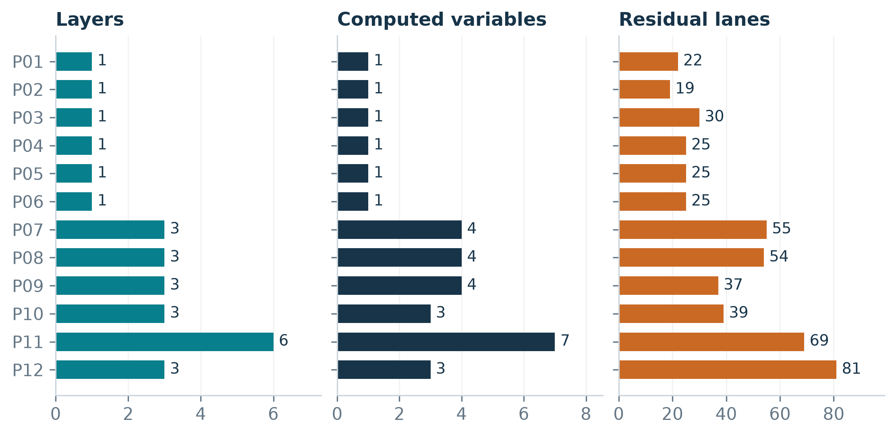{width=full page=portrait}

Figure 1. Compiler properties are different notions of complexity. P11 is deepest; P12 is widest. Program numbers are identifiers, not an ordered difficulty scale. Source: R1.

## A schedule is a map of first writes

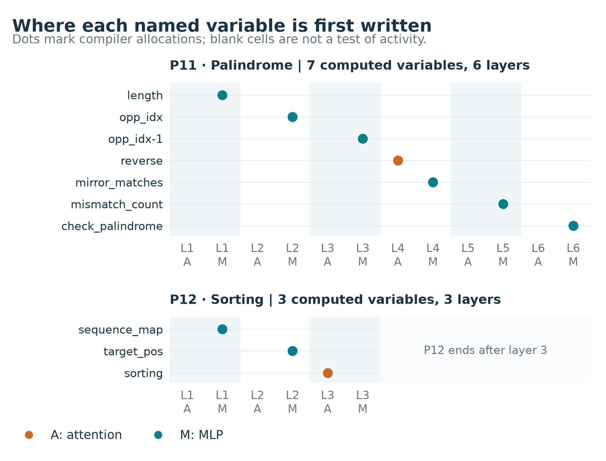{width=full page=portrait}

Figure 2. Compiler allocations for P11 and P12, with numeric expression suffixes removed for readability. Source: R1/manifest.json, variable and program records.

**How to read it.** Rows are computed variables. Columns are attention (A) and MLP (M) stages. Each dot marks the variable's first scheduled write; orange means attention and teal means MLP.

**What it shows.** P11 builds length, opposite positions, reversed tokens, mirror matches and a mismatch count before writing the palindrome answer at Layer 6 MLP. P12 writes three variables, ending with sorted values at Layer 3 attention. P12 is wider, but P11 has more layers and variables.

**The boundary.** Blank cells do not mean the model is inactive. The chart records allocations, not measured activation onset, variable lifetimes or last uses.

# 02 · Trace the compiled circuit

#### Purpose and scope

Check whether a manual evaluation of the compiled blocks reproduces the assembled transformer's calculations. Step 2 independently compiles the models and adds two focused examples: **A**, previous-token lookup, and **B**, histogram followed by a repeated-token classifier.

On `[1, 2, 1]`, A returns `[1, 1, 2]`; its first position repeats itself. B first computes counts `[2, 1, 2]`, then returns `[1, 0, 1]` by checking whether each count exceeds one.

#### What is traced

The code builds both the explicit Craft circuit and the assembled transformer from the same compilation. It creates the embedding for `[BOS, *tokens]`, including token, position and constant-one lanes where present. It then follows active Craft blocks in compiler order.

For attention, the tracer explicitly computes queries, keys, scaled logits, stable row-wise softmax weights and the value-weighted update. Multiple heads contribute to the same residual update. An MLP uses the compiled Craft block's `apply` operation.

Attention weights = softmax(Q WQK KT / √dkey) Next residual = current residual + block update

After each active block, the tracer saves a copy of the full residual and its projection into output-score coordinates. A layer has attention and MLP stages, but only active Craft blocks appear in these traces.

#### How agreement is assessed

| Comparison | Treatment |
| --- | --- |
| Input embeddings | Must agree within tolerance |
| Intermediate and final residuals | Compare and record any residual warnings |
| Final output scores | Must agree within tolerance |
| Decoded sequence versus RASP | Must agree within tolerance |

Step 2 uses absolute and relative tolerance **10-4**. Attention arithmetic is explicit NumPy; MLP execution reuses Craft. This is a manual trace of compiled blocks, not a wholly independent implementation of the compiler and network.

## A concrete trace: histogram to classification

For B on `[1, 2, 1]`, there are four residual rows, including BOS, and **27 lanes**. The saved active blocks are:

| Order | Active block | Role in this example |
| --- | --- | --- |
| 1 | Layer 1 attention | Begin the histogram calculation |
| 2 | Layer 1 MLP | Write the categorical histogram count |
| 3 | Layer 2 MLP | Map count to the repeated-token class |

There is no Layer 2 attention trace entry because that block is inactive in the Craft circuit. The later geometry study still records every assembled attention/MLP boundary.

Input: [1, 2, 1] Known histogram: [2, 1, 2] Known repeated-token label: [1, 0, 1]

#### Saved result

**All 70 sample traces completed**: fourteen programs multiplied by five input sequences. The archive contains **220 active-block residual snapshots**, with **zero residual warnings**. The largest absolute score discrepancy and the largest residual discrepancy are both **1.90735 × 10-6**, below the configured absolute tolerance.

This gives later work a checked tracing route. It does not imply bit-for-bit equality, proof for all sequences, or that geometric metrics are already validated.

#### What to inspect in the repository

`traces.json` contains inputs, expected and decoded answers, manual and assembled scores, and each post-block residual. The manifest contains per-program maximum errors and warning counts. Notebook 02 defaults to inspecting B, making the count-to-class transition easy to follow.

Implementation: compiler.py: build_trace_model, manual_craft_forward, check_trace_sample. Evidence: R2.

## Watch counts turn into labels

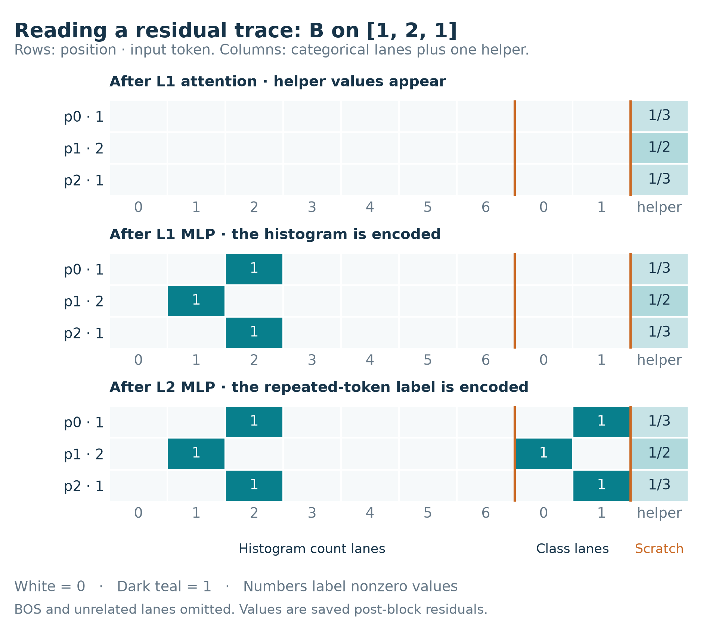{width=full page=portrait}

Figure 3. Selected lanes from B's saved manual trace. Sources: R2/traces.json and the residual labels in R2/manifest.json.

**How to read it.** A row is an input position. Count 2 is a value of 1 in the column labelled 2. The three panels follow the active blocks in order; BOS and unrelated lanes are omitted.

**What it shows.** Helper values appear first. The count lanes then encode [2, 1, 2]; the class lanes later encode [1, 0, 1]. Earlier counts persist beside the new labels. Fractions are rounded displays of saved values.

**Why it matters.** The helper has activity before a named count is written. Geometry can reflect compiler helper state as well as semantic variables. This picture documents one input's trace.

# 03 · Measure representation geometry

#### Purpose

Describe the distribution of internal representations while each algorithm runs. This step measures geometry before assigning it a computational interpretation.

#### Build and sample the probes

The seeded pool contains **3,383 unique sequences of length six**. It combines constant, alternating and controlled-count patterns, random draws, sorted patterns, unique-token sequences and palindromes. Duplicates are removed, retaining the first family label. It is a designed pool, not all 86 possible sequences.

For each program, RASP labels every candidate-position pair. The sampler selects **64 observations per reachable output class**, approximately balancing reachable positions within each class. Sampling uses seed `42 + 1009 × program_index`; small buckets may be sampled with replacement.

This produces **6,464 target observations** across all fourteen programs: 5,824 for P01–P12 and 640 for A/B. Different programs have different target-input distributions. Repeated targets retain weight and are not independent trials.

#### Collect aligned stage vectors

The full sequence is run through the compiled model, but each observation retains one nominated target position. Its vector is recorded at embedding and after every attention and MLP stage. A model with L layers therefore supplies **1 + 2L stages**. The compiled target output is checked against its RASP label before measurement.

| View | Included coordinates | Interpretation |
| --- | --- | --- |
| Full | Every residual lane | Includes token, position and constant inputs |
| Computed | All lanes except those input names | Still includes scratch/helper and unwritten lanes |

Rows stay aligned across stages within a program. CKA comparisons require this alignment. The computed view should not be read as a collection of only live semantic variables.

Implementation: geometry.py: candidate_pool, sample_targets, collect_activations. Evidence: R3. Current collection is batched for memory; the historical run records its original source hashes.

## What each metric measures

Let X be a matrix whose rows are target observations and whose columns are residual lanes. Subtract each column's mean to obtain Xc. Features are not standardized or whitened.

**PCA** decomposes C = XcTXc / (N - 1). Its eigenvalues λ describe variance along principal directions. The code records the spectrum and the smallest numbers of components explaining 95% and 99% of total variance.

Participation ratio: PR = (Σ λ)2 / Σ λ2

PR describes effective dimensionality of the sampled representation. It depends on encoding, relative feature scales and correlations. It is not a count of program variables. Zero total variance is recorded as PR = 0.

Linear CKA(X, Y) = ‖XcTYc‖F2 / (‖XcTXc‖F · ‖YcTYc‖F)

CKA compares representations of the same ordered observations. The study computes all stage pairs, plus exports restricted to embedding and full-layer endpoints. If either centered representation has zero norm, CKA is **undefined**, not zero. See [Kornblith et al.](https://proceedings.mlr.press/v97/kornblith19a.html) for the representation-similarity method.

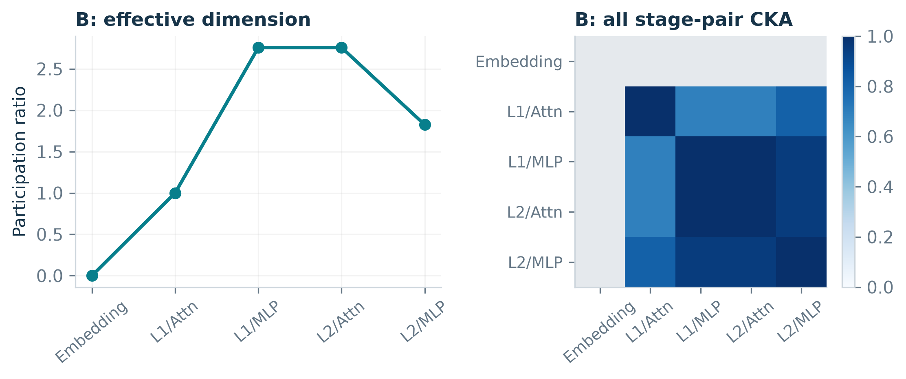{width=full page=portrait}

Figure 4. Saved computed-view geometry for B. Gray CKA cells are undefined. Nonzero dimensions and high similarity describe variance structure; they do not by themselves identify which variable was computed. Source: R3.

The notebook also shows individual lane variances and single-target trajectories. Trajectory coordinates use one PCA basis fitted jointly across stages, so points share a coordinate system. All 6,464 saved target outputs agree with RASP; the numerical export contains 148 program/view/stage rows.

## Read the probe design visually

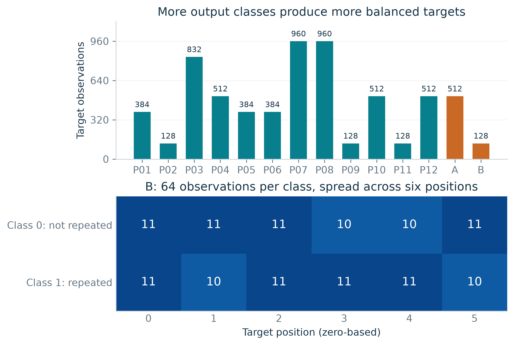{width=full page=portrait}

Figure 5. Saved Step 3 observation counts and the position allocation for B. Teal bars are the main program set; orange bars are the focused examples. Source: R3/balance_audit.csv and probes_B_histogram_then_repeated_class.csv.

**How to read it.** Each top bar counts selected target positions, including repeated selections. The bottom grid splits B's targets by output class and position. Every row sums to 64; cells contain 10 or 11 observations because 64 does not divide evenly by six.

**What it shows.** P07 and P08 have 15 reachable output classes, so each gets 960 targets. B has two classes and gets 128. The balance rule is consistent even though the program totals differ.

**Why it matters.** Balanced outputs do not imply identical inputs across programs. Step 5 addresses this by giving every main program the same 20,298 candidate-position pairs. Neither design makes observations from the same input sequence independent.

## One variable, several dimensions

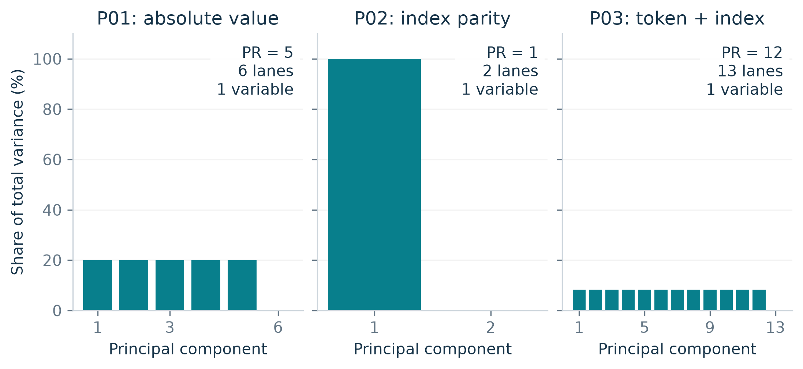{width=full page=portrait}

Figure 6. Final computed-view PCA spectra under the Step 3 balanced probes. Each panel is one program with one computed RASP variable. Sources: R3/pca_spectra.npz and layer_metrics.csv.

**How to read it.** A bar is a principal component, and its height is its percentage of total variance. The bars in each panel sum to 100%. A tall single bar means variance is concentrated in one direction; many equal bars mean it is spread evenly.

**What it shows.** P01's six categorical output values occupy six one-hot lanes. Centering removes one direction, leaving five equal directions of 20% each and PR = 5. P02 has one direction with all the variance, so PR = 1. P03 has twelve equal directions of about 8.33% each, so PR = 12.

**The interpretation.** All three programs compute one variable. Their different PRs come from their encoded value distributions. This is why Step 4 compares observed PR with the PR of the encoded RASP values on the same probes.

For k equally weighted one-hot categories, centering leaves k - 1 equal nonzero directions. Under that specific distribution, PR = k - 1.

Different category frequencies or a different encoding can change the spectrum. The numbers here describe these saved probes and representations.

# 04 · Align measurements with known computation

#### Purpose

Compare observed vectors with an explicit RASP benchmark on exactly the Step 3 probes, and check focused causal predictions for A/B. The fourteen saved probe files in Steps 3 and 4 are identical.

#### Construct the expected representation

For every intermediate sequence variable, evaluate its value at the selected target and encode it using the compiler's basis: categorical values become one-hot vectors, numerical values become scalars, and undefined values become zero. Insert that encoding at its scheduled first write and retain it thereafter.

The benchmark holds **variables written so far**. Unwritten and scratch lanes are zero. The full view also includes token, position and constant-one embeddings. No downstream-use or lifetime analysis is performed, so this is not a live-variable benchmark.

#### Make three observational comparisons

**PR:** compute observed and expected participation ratios on the same observations. Save the signed difference, observed minus expected. Differences may reflect helper activity, approximation or the explicit encoding convention.

**CKA:** compare adjacent observed stages and annotate scheduled writes. A new write need not reduce similarity. The retained Step 4 run has observed CKA only; expected CKA was added for Step 5.

**Lanes:** compare each known scalar lane at its write and all later stages. Record maximum absolute error, fraction within tolerance, and Pearson correlation. With the current settings, a value passes when:

|observed - expected| ≤ 10-4 + 10-4 × |expected|

Correlation is unavailable for constant lanes. Even a value near one does not prove that magnitudes are correct.

## Check the causal predictions for A/B

Each of the **640 balanced targets** gets two conditions: an unchanged-value control and a donor-value substitution. The donor is the first probe at the same position with a different output class. Its encoded variable value is valid under the compiler's basis.

For **A**, substitute the previous-token value immediately after its attention write. This patches the output itself, so it is a direct-readout control. For **B**, substitute the histogram count after Layer 1 MLP and continue through the repeated-token classifier, testing a downstream dependency.

First, the unmodified manual trace must agree with the assembled model, including residuals. Then patch only the selected variable lanes at the selected target, leaving BOS and other positions untouched. Continue the manual circuit and compare its entire output sequence and output scores with RASP reevaluation under the same substitution.

#### An actual saved B intervention

| Item | Saved value |
| --- | --- |
| Input sequence | `[3, 3, 3, 5, 5, 5]` |
| Target position | Index 4, the fifth token |
| Histogram value | Original 3; donor replacement 1 |
| Donor input | `[-2, 1, 5, 0, -1, 1]`, also at index 4 |
| Patch location | Immediately after Layer 1 MLP |
| Original labels | `[1, 1, 1, 1, 1, 1]` |
| Predicted and observed labels | `[1, 1, 1, 1, 0, 1]` |

The downstream classifier now sees count 1 at that target, so its repeated-token label becomes 0. Replacing 3 with 3 in the control leaves every output unchanged.

| Condition | A: sequence and score agreement | B: sequence and score agreement |
| --- | --- | --- |
| Unchanged-value control | 512 / 512 | 128 / 128 |
| Outcome-changing donor | 512 / 512 | 128 / 128 |

All **1,280 conditions** agree with the RASP predictions. Every donor changes exactly its intended target; every control changes no positions.

These are valid-value interventions in the checked manual circuit, not zero ablations or hooks into the assembled forward pass. Outcome-changing donors were deliberately selected; their change rate is not an unbiased importance estimate. This causal evidence is limited to A/B.

Implementation: alignment.py: intervene, rasp_with_patch. Evidence: R4/interventions.csv.

## Follow one intervention end to end

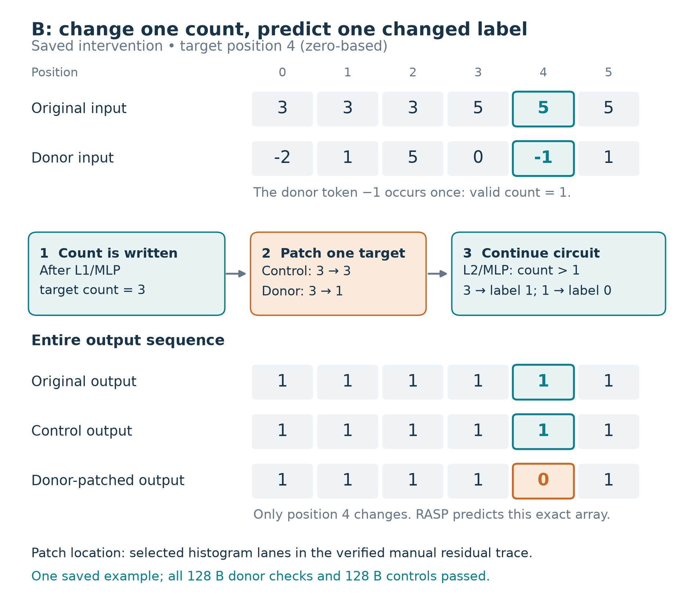{width=full page=portrait}

Figure 7. The saved B intervention at probe 0, position 4, using donor probe 23. Source: R4/interventions.csv.

**How to read it.** Follow the highlighted fifth position down the page. The donor supplies a count of 1, not its input token. The patch occurs after the count is written; the downstream classifier then reads the replacement.

**What it shows.** The control preserves all six labels. The donor changes only the intended label from 1 to 0, matching RASP's substituted computation with zero output-score error.

**Scope.** This is one of 128 B donor checks, each paired with a control. Donors were selected to change the answer. The result checks this dependency in the verified manual circuit; it does not estimate general variable importance.

## What the lane checks reveal

Step 4 exports **1,038 lane/stage comparison rows**. Of these, 1,022 have every observation within tolerance. The remaining **16 rows** are the eight categorical sorting-output lanes at P12's final attention and MLP boundaries.

Their maximum absolute error is **0.000852227**, while Pearson correlation is approximately one. Every decoded target answer is still correct. These are coordinate-amplitude discrepancies, not sixteen incorrect sequence outputs.

> A strong correlation can coexist with the wrong magnitude. Direct value agreement and output decoding answer different questions, so the report keeps them separate.

Step 4 also makes the dimensionality issue concrete: P01, P02 and P03 each compute one sequence variable, yet their final expected PRs under the balanced probes are **5, 1 and 12**, respectively. Categorical support, centering and sample distribution determine the representation's effective dimension.

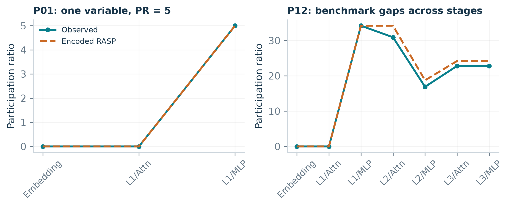{width=full page=portrait}

Figure 8. P01 has one computed variable but final PR = 5 under these balanced categorical probes. P12 shows larger benchmark gaps. The plots compare encoded distributions, not PR with a variable count. Source: R4.

#### How Step 4 leads to Step 5

The per-program plots establish detailed alignment behavior. A comparison across programs additionally needs explicit summary definitions and a common input design. Step 5 supplies these. The current notebook places the cross-program complexity comparison there; the older Step 4 result folder still preserves its original exploratory scatter.

Evidence: R4/stages.csv, lanes.csv and interventions.csv. Step 4's saved tables precede the expected-CKA and first-write summary fields added for Step 5.

## Why correlation needs a value check

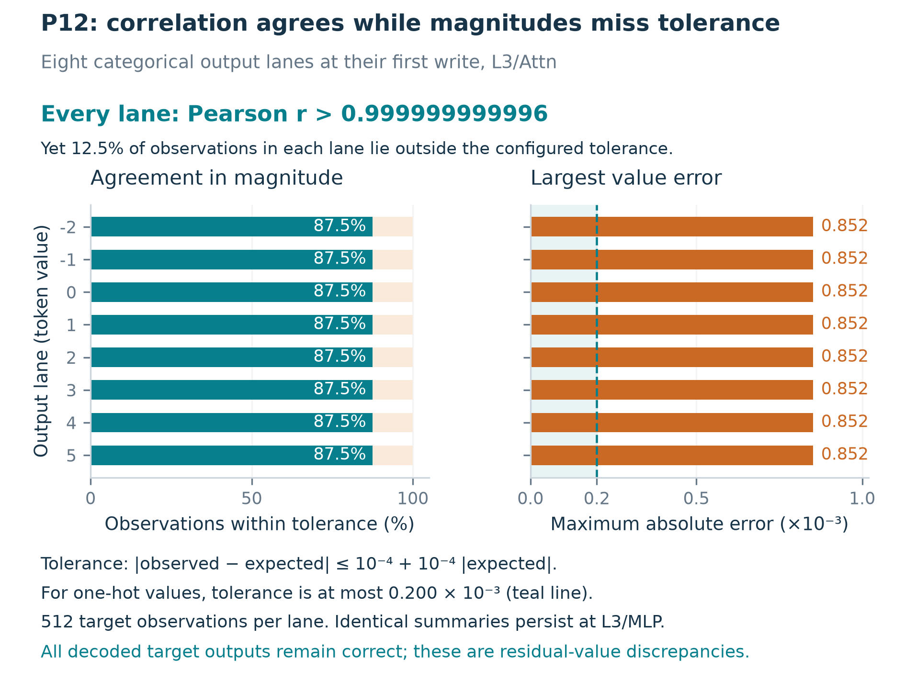{width=full page=portrait}

Figure 9. P12's eight sorting-output lanes at their first write, L3/Attn, under balanced probes. Source: R4/lanes.csv.

**How to read it.** Each row represents one categorical output lane, not a token position. The left panel counts observations within tolerance. The right panel shows each lane's worst absolute discrepancy; its numbers are multiplied by 10-3. The dashed line is the largest allowed tolerance for a one-hot value.

**What it shows.** Correlation exceeds 0.999999999996 in every lane, yet each passes the value check on only 87.5% of its 512 observations. The maximum error, 0.000852227, is over four times the largest permitted tolerance of 0.0002.

**The distinction.** Correlation measures co-variation and can remain almost perfect despite an amplitude discrepancy. All decoded answers still pass. The same eight rows recur at L3/MLP, accounting for the 16 lane/stage discrepancies reported above.

# 05 · Compare P01–P12 on shared inputs

#### Purpose

Measure how agreement varies across the twelve main programs and their measured compiler properties. P01–P12 anchor this comparison. A/B remain supporting examples in Step 4.

#### The main and sensitivity designs

**Matched inputs:** use every sequence in the existing 3,383-sequence pool at all six positions. Every program receives the same **20,298 observations**, in the same order and with equal observation weights. This yields 243,576 program-observations across twelve models.

**Balanced inputs:** recreate the original class-balanced probes for P01–P12, totaling 5,824 observations. Rerun their measurements to add expected CKA. The previously retained numerical fields match Step 4 exactly. The two designs differ in both input weighting and sample count.

The matched pool contains 2,032 sequences first labelled random, 840 controlled-count, 128 unique-token, 125 increasing, 124 decreasing, 70 palindrome, 56 alternating and 8 constant. These family counts reflect deduplication order. Using all candidates still does not cover all **262,144** possible length-six vocabulary sequences.

#### Fix a separate agreement measure for each check

| Check | Step 5 summary and denominator |
| --- | --- |
| PR | Mean absolute observed-minus-expected PR over all post-embedding half-layer stages; equal stage weights |
| Lane values | Mean fraction within tolerance at first writes only; equal scalar-lane and observation weights |
| CKA | Mean absolute observed-minus-expected adjacent CKA where both are defined; report the valid-pair count |

Signed PR means and final gaps remain available. Wider categorical variables contribute more lanes to the lane summary. CKA has an extra availability check: count transitions where one representation's CKA is defined and the other's is not. A program with no valid CKA pairs receives **N/A**.

The three complexity measures are total computed-variable count, maximum dependency depth and compiled layer count. No live-variable count or combined agreement score is inferred.

Implementation: geometry.py: build_matched_probes; alignment.py: summarize_alignment; notebook 05. Evidence: R5.

## The main results

The table uses matched inputs and the computed residual view. “CKA pairs” is the number of transitions where both scores are defined, divided by all post-embedding transitions. “Status mismatch” counts transitions where only one score is defined. Lower PR/CKA error and higher lane agreement indicate closer agreement with this specific benchmark.

| ID | PR error | Lane agreement | CKA error | CKA pairs | Status mismatch |
| --- | --- | --- | --- | --- | --- |
| P01 | 0 | 100.00% | N/A | 0/2 | 0 |
| P02 | 0 | 100.00% | N/A | 0/2 | 0 |
| P03 | 0 | 100.00% | N/A | 0/2 | 0 |
| P04 | 0 | 100.00% | < 10-12 | 1/2 | 0 |
| P05 | 0.5034 | 100.00% | N/A | 0/2 | 1 |
| P06 | 0.7600 | 100.00% | N/A | 0/2 | 1 |
| P07 | 0.5000 | 100.00% | 4.76e-08 | 2/6 | 3 |
| P08 | 0.5000 | 100.00% | 5.09e-08 | 2/6 | 3 |
| P09 | 0.0795 | 100.00% | 0.0028 | 5/6 | 0 |
| P10 | 0.5000 | 100.00% | 3.93e-08 | 2/6 | 3 |
| P11 | 0.2700 | 100.00% | 0.0004 | 8/12 | 3 |
| P12 | 2.1339 | 98.41% | 0.0855 | 4/6 | 0 |

**Coverage matters.** Only **24 of 54** possible computed-view transitions enter CKA error means. There are **14 availability mismatches**. The balanced design also supplies 24 paired transitions, but only two availability mismatches. Tiny CKA error on the retained pairs is therefore not the whole result.

**Lane agreement is not output accuracy.** P12's 98.41% is an average over 63 first-write scalar lanes and all observations. Its eight sorting-output lanes contain tolerance discrepancies; compiled target decoding still agrees with RASP. Other programs have 100% first-write lane agreement at the selected tolerance.

**The residual view changes the comparison.** In the full view, all 54 adjacent CKA transitions are defined on both sides, with no availability mismatches. Inputs add variance that is absent from the computed view. Full and computed results should be named explicitly whenever a number is quoted.

Table 1. R5/comparison.csv, matched/computed rows. Rounded for display; exact values remain in the CSV.

## Sampling and complexity: what changes?

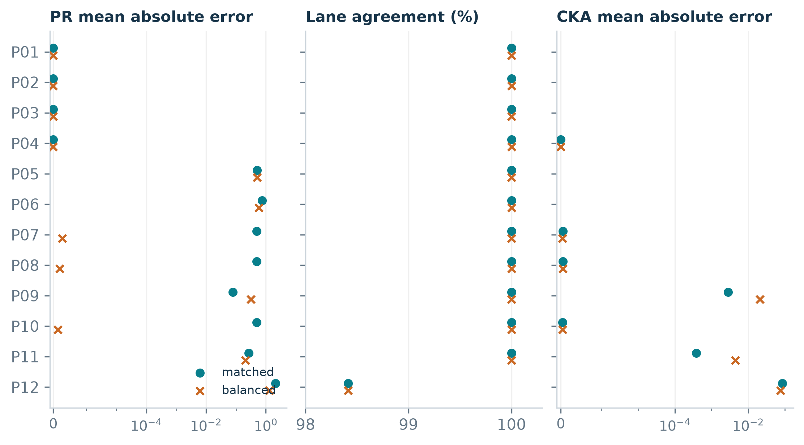{width=full page=portrait}

Figure 10. Matched and balanced agreement summaries, computed view. Missing CKA points are undefined. PR/CKA axes use a symmetric log scale with a linear region near zero; the lane axis is zoomed. Source: R5.

P09's PR error changes from **0.3192 to 0.0795**, and its CKA error from **0.02089 to 0.002789**, when moving from balanced to matched inputs. P12's PR error changes from **1.3153 to 2.1339**. These are measured differences under two designs, not significance estimates or isolated effects of complexity.

P07, P08 and P10 need particular care. Their computed-view PR errors rise from about 10-7 to **0.5**. The increase localizes to the first three stages, where observed PR is 1 and expected PR is 0. The saved stage tables do not include total variance, so they cannot determine whether these changes arise from very small numerical variation, scratch signals, or another source. Normalized PR can remain nonzero even when the underlying variation is tiny.

## See which CKA comparisons exist

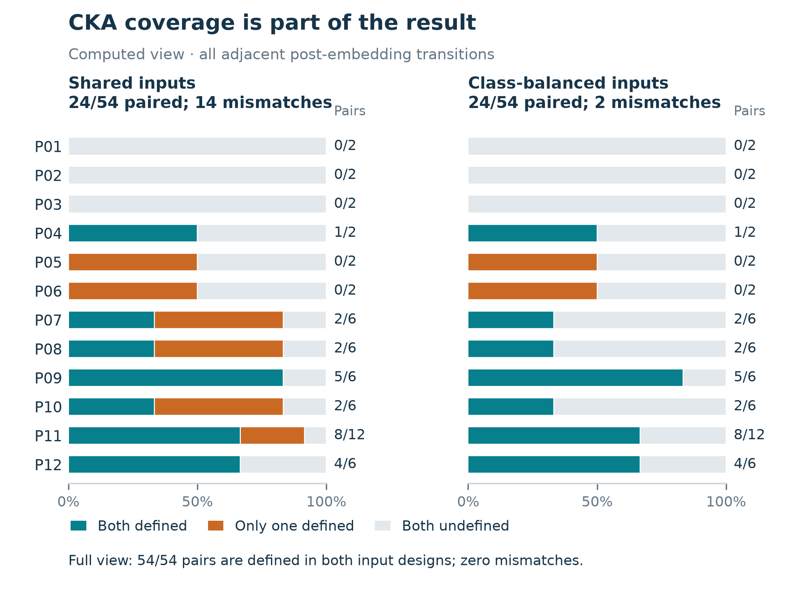{width=full page=portrait}

Figure 11. Availability of adjacent observed-versus-reference CKA pairs in the computed view. Source: R5/comparison.csv.

**How to read it.** Each bar contains all transitions for one program. Teal pairs enter the CKA error mean; orange and gray transitions do not. The right-hand fraction supplies the actual count, because programs have different numbers of transitions.

**What it shows.** Both designs have 24 usable pairs out of 54. Shared inputs produce 14 availability mismatches, compared with two under class balance. P07, P08, P10 and P11 each contribute three additional mismatches. With the full residual view, all 54 pairs are defined in both designs.

**Why the missing values matter.** A tiny CKA error describes only the teal portion. Undefined is not zero similarity. The implementation accepts any positive covariance norm; the saved summaries alone cannot establish whether very small nonzero variation is meaningful signal or numerical variation.

## The same inputs, two residual views

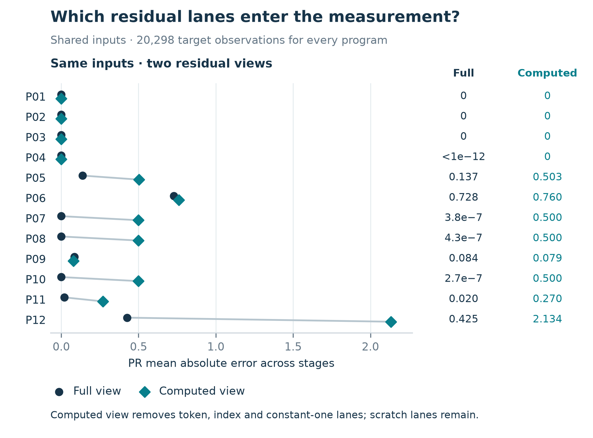{width=full page=portrait}

Figure 12. Matched-input PR error under two coordinate selections. Every program uses the same 20,298 observations. Source: R5/comparison.csv.

**How to read it.** Navy circles include the full residual; teal diamonds remove the named input lanes. Lower error means closer PR agreement with the encoded RASP benchmark. Connecting lines join two views of one program, not a trajectory or confidence interval.

**What it shows.** P12 changes from 0.4255 in the full view to 2.1339 in the computed view. P07, P08 and P10 have full-view errors below 5 × 10-7, while their computed-view errors are about 0.5. P09 moves slightly in the opposite direction.

**Interpretation.** Selecting coordinates changes how variance is distributed, so it can change PR agreement. The computed view still contains helper lanes. These numbers do not identify the magnitude or cause of early variation, and they do not imply incorrect decoded outputs.

## Read the complexity plots cautiously

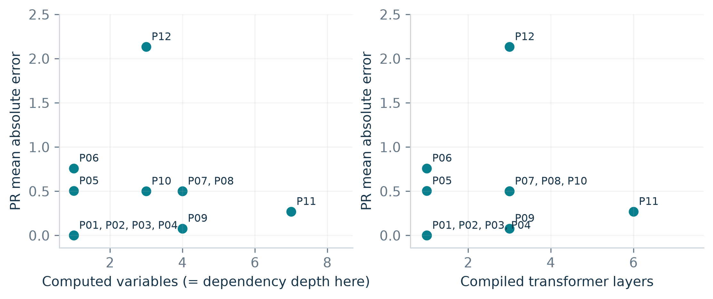{width=full page=portrait}

Figure 13. Matched computed-view PR error against measured complexity. Computed-variable count and dependency depth are identical for every program in this set, so they share one axis here. The notebook retains all three declared axes. Source: R5.

P11 has seven computed variables, dependency depth seven and six compiled layers. P12 has three computed variables, depth three and three layers, yet shows the largest PR error. The twelve labels do not define a monotonic complexity ladder.

P12's largest matched stage gap occurs at **L2/Attn**, before its final output write: observed PR 38.9257 versus expected 46.8449, a signed gap of **-7.9192**. The named-lane tolerance discrepancies appear later. The entire PR difference therefore cannot be attributed to the final sorting-output amplitude error alone.

The benchmark deliberately zeros scratch and unwritten lanes. Geometry can respond to those lanes even when checked named variables agree. Diagnosing individual gaps requires looking at their stage, view, encoding and variance magnitude, rather than assigning every gap the same meaning.

#### What this step adds

Step 5 makes input comparability and aggregation explicit, exposes missing CKA coverage, and shows how much the chosen probe design matters to the recorded summaries. It does not establish that complexity causes lower agreement, that the three metrics give independent evidence, or that the same behavior will hold in trained language models.

# What we can conclude

#### Supported by the saved evidence

1. **The sampled compiled outputs agree with RASP.** Steps 1–3 and both Step 5 designs record successful output checks within the chosen tolerances.
2. **The tracing route reproduces the compiled circuit closely.** Step 2's maximum recorded discrepancy is approximately 1.91 × 10-6, with no residual warnings at 10-4.
3. **Direct lane checks add information beyond correlation.** P12 retains near-perfect lane correlations while some magnitudes exceed tolerance.
4. **The focused causal predictions succeed.** All 1,280 A/B conditions match the specified intervention predictions, with controls unchanged.
5. **Geometry depends on the observation design and representation view.** The saved matched/balanced and full/computed comparisons make that dependence visible.

#### Claims the study does not establish

There is no universal “trust curve” for PR or CKA, no validated ranking of P01–P12 by difficulty, no live-variable analysis, and no all-program causal-ablation study. Agreement with reconstructed compiler representations measures fidelity to this explicit benchmark. It does not independently show that a metric can discover computation in an unknown trained network.

PR, lane and CKA checks share representations, so their agreement is related. A completed manifest indicates that the numerical study finished and its outputs were saved. It does not mean every comparison passed or that notebook plotting was included in the completion status.

#### The next scientific question

The most useful follow-up is to explain the localized gaps: record variance magnitude at the early stages with unexpected computed-view PR, and inspect the contribution of compiler helper lanes. This is a proposed diagnostic, not work already performed in the saved study. Any later extension to live variables or P01–P12 causal interventions needs its own explicit definition.

> A defensible description of the project: “We evaluate representation measurements against known computations in Tracr-compiled transformers, then compare their agreement across twelve programs under matched and balanced probe designs.”

# Source register and reader guide

#### Saved runs used in this report

All paths below are relative to the repository's `results/` directory. The dated runs are the numerical evidence; reference folders and the archive provide historical context.

| Key | Evidence folder | Main files |
| --- | --- | --- |
| R1 | `programs/20261007T071415_1d4b7299/` | `manifest.json`, `schedule.md` |
| R2 | `trace/20261007T071435_2694c39c/` | `manifest.json`, `traces.json` |
| R3 | `geometry/20261007T071505_930a7a88/` | `layer_metrics.csv`, probe and CKA tables, `pca_spectra.npz` |
| R4 | `alignment/20261008T061604_c489bd97/` | `stages.csv`, `lanes.csv`, `variables.csv`, `values.csv`, `interventions.csv` |
| R5 | `comparison/20261008T064602_ac76cb03/` | `comparison.csv`, `matched/`, `balanced/`, sampling and CKA-write summaries |

Steps 1–3 were recorded on 7 October 2026; Steps 4–5 on 8 October 2026. Their manifests record configuration, software versions and source hashes. The recorded environment uses Python 3.12.14, Tracr 1.0.0, CPU execution and Tracr commit `9ce2b8c82b6ba10e62e86cf6f390e7536d4fd2cd`.

Current source contains later enhancements. In particular, expected adjacent CKA, first-write flags and compiled-layer fields are available in Step 5, but absent from the retained Step 4 tables. This report attributes numerical findings to the saved run that actually contains them.

#### Navigate the code

| Location | Responsibility |
| --- | --- |
| `raspformer/programs.py` | Define the algorithms and focused examples |
| `raspformer/compiler.py` | Compile, check outputs, derive writer schedules and trace blocks |
| `raspformer/geometry.py` | Construct probes, collect residuals, calculate PCA and CKA |
| `raspformer/alignment.py` | Encode expected values, compare lanes and metrics, run A/B substitutions |
| `notebooks/01_programs.ipynb` through `05_comparison.ipynb` | Configure, run, inspect and interpret each step |

Every notebook can build its own models. They form an explanatory sequence, rather than requiring one long-lived model object to pass between notebooks. Reports, manifests and raw CSVs provide the handoff between measurements and interpretation.

## Terms and references

| Term | Meaning in this repository |
| --- | --- |
| RASP variable | A sequence-valued expression in the known program |
| Residual lane | One scalar coordinate of the transformer's residual vector |
| Writer | The allocated block that first writes a variable's output basis |
| Half-layer stage | A boundary after attention or after an MLP |
| Probe | A sequence together with one selected target position |
| Computed view | Residual lanes excluding named token, index and constant inputs |
| Scratch lane | Compiler helper state, not included as a named RASP value in the expected benchmark |
| PR | Participation ratio: effective dimensionality of sampled variance |
| CKA | Centered kernel alignment: similarity of aligned representations |
| Donor patch | A substitution using a valid intermediate value from another probe |
| Lane agreement | Tolerance-based scalar-value agreement, distinct from decoded output correctness |

#### Research foundations

**RASP.** Gail Weiss, Yoav Goldberg and Eran Yahav. *Thinking Like Transformers*. ICML, 2021. [Read the paper](https://proceedings.mlr.press/v139/weiss21a.html).

**Tracr.** David Lindner and colleagues. *Tracr: Compiled Transformers as a Laboratory for Interpretability*. NeurIPS, 2023. [Read the paper](https://arxiv.org/abs/2301.05062).

**CKA.** Simon Kornblith, Mohammad Norouzi, Honglak Lee and Geoffrey Hinton. *Similarity of Neural Network Representations Revisited*. ICML, 2019. [Read the paper](https://proceedings.mlr.press/v97/kornblith19a.html).

The formulas and aggregation conventions in this report follow the repository implementation. Figures were redrawn from the saved numerical tables for print readability. Numbers are rounded for presentation; the CSV and JSON files retain the recorded values.

Report prepared 8 October 2026 from the RaspFormer workspace. No experiment parameters or saved numerical results were changed to produce this document.

